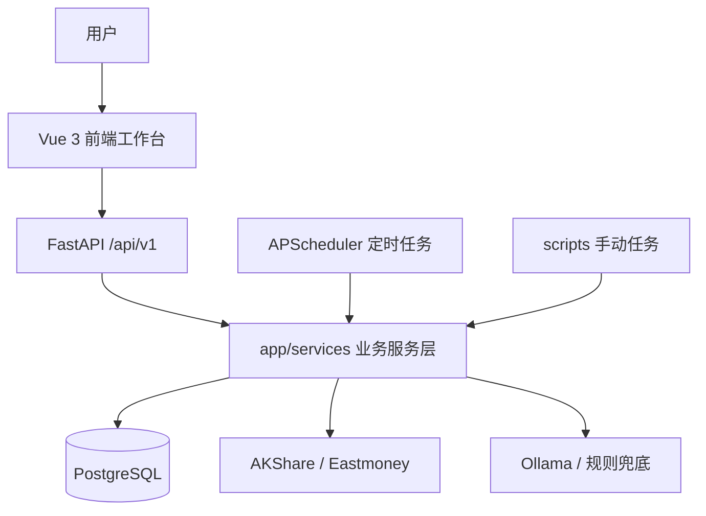

# FundPilot 技术架构

FundPilot 是一个本地单用户基金投研助手，核心由 Vue、FastAPI、SQLAlchemy、PostgreSQL、Pandas、APScheduler 和 Ollama 组成。

## 架构图



## 模块职责

- `frontend`：Vue 3 + TypeScript + Element Plus + ECharts，承担所有前端交互。
- `app/api/v1`：结构化 HTTP API，供 Vue 调用。
- `app/services`：业务逻辑，包括净值同步、指标计算、评分、持仓、预警、相关性、数据健康、AI 报告。
- `app/data_source`：基金和市场数据源，以 AKShare 为主，Eastmoney 作为备用与对账来源。
- `app/db`：SQLAlchemy session、ORM 模型和基础声明。
- `app/jobs`：可选定时任务，默认关闭，设置 `ENABLE_SCHEDULER=true` 后由 FastAPI lifespan 启动。
- `scripts`：命令行任务入口，用于本地调试、回填、演示和 smoke check。

## 核心数据流

```text
watchlist -> sync nav -> fund_nav -> indicators -> scores -> Vue/report
market indexes -> market_index_daily -> market context -> Vue/report
portfolio_position + latest nav -> portfolio overview -> alerts/report
fund_nav daily_return -> correlation -> duplicate allocation alerts
task execution -> task_run_log -> task center
```

## 启动边界

开发环境可以通过 `AUTO_CREATE_TABLES=true` 快速建表；正式交付建议先运行 Alembic 迁移。定时任务默认关闭，避免本地调试时意外触发外部数据抓取。

## 产品边界

系统只做本地数据监控、规则评分和解释性总结，不提供直接买卖建议。AI 只读取结构化数据，不自由联网搜索。
