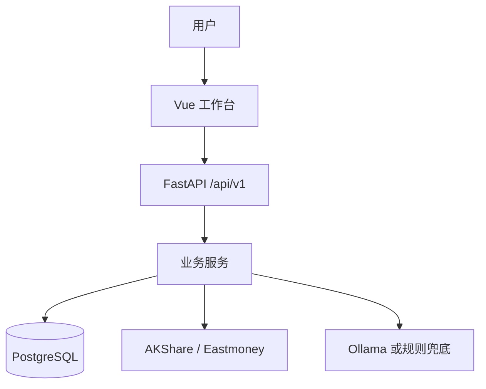

# 技术架构

FundPilot 采用本地单用户架构，前端负责交互，后端负责业务计算和数据持久化。

## 分层

- Vue 前端：展示今日驾驶舱、自选基金、基金详情、组合持仓、相关性、AI 简报和任务中心。
- FastAPI：提供 `/api/v1/*` 结构化接口，保持前端调用稳定。
- Service 层：承载净值同步、指标计算、规则评分、组合诊断、预警生成、相关性和 AI 报告逻辑。
- 数据源层：封装 AKShare 和 Eastmoney，降低外部数据字段变化对业务逻辑的影响。
- 数据库：PostgreSQL 保存基金、净值、指标、评分、持仓、预警、AI 报告和任务日志。
- 任务层：APScheduler 可选启用；本地演示和开发优先使用手动任务。

## 数据流

## 关键闭环

1. 添加自选基金。
2. 一键同步并分析：同步净值、计算指标、生成评分、生成基金解释。
3. 今日驾驶舱聚合待办、风险、预警、市场和日报。
4. 持仓页用真实持仓生成组合诊断。
5. AI 简报把结构化数据总结为每日复盘。

## 边界

系统只做数据监控、规则评分、风险提示和解释性总结，不提供直接买卖建议。AI 只读取本地结构化数据，不自由联网搜索。
