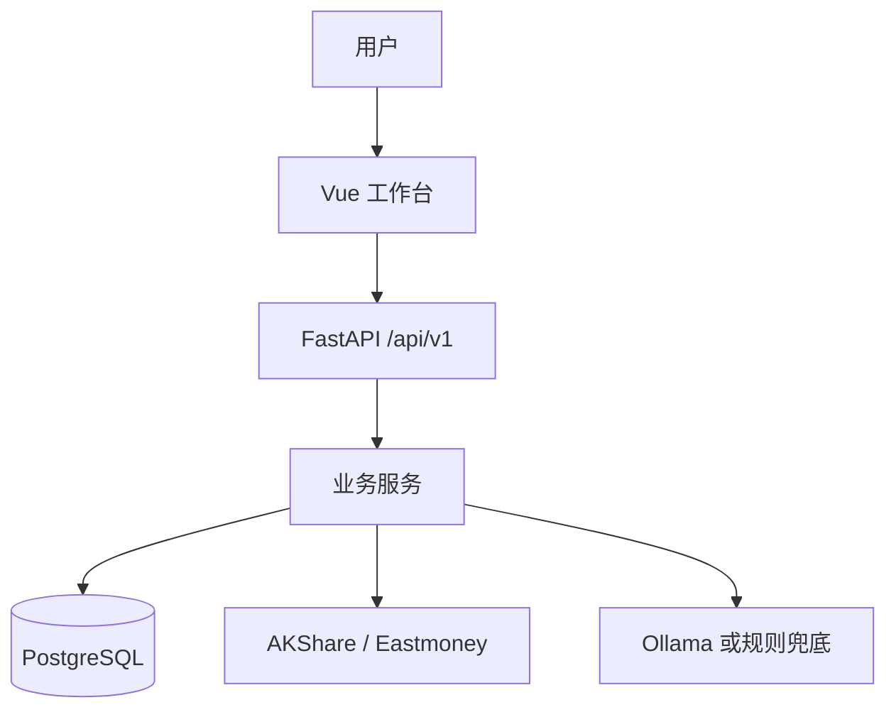

# 技术架构

FundPilot 采用本地单用户架构，前端负责交互，后端负责业务计算和数据持久化。

## 分层

- Vue 前端：展示今日驾驶舱、自选基金、基金详情、组合持仓、相关性、AI 简报和任务中心。
- FastAPI：提供 `/api/v1/*` 结构化接口，保持前端调用稳定。
- Service 层：承载净值同步、指标计算、规则评分、组合诊断、预警生成、相关性和 AI 报告逻辑。
- 数据源层：封装 AKShare 和 Eastmoney，降低外部数据字段变化对业务逻辑的影响。
- 数据库：PostgreSQL 保存基金、净值、指标、评分、持仓、预警、AI 报告、任务批次与日志。
- 任务层：每日批次（`task_batch` / `task_batch_item`）持久化在 PostgreSQL，由独立 worker 进程（`python -m app.worker`）按依赖推进；启用调度时 APScheduler 只负责每天创建批次。旧的单任务端点保留兼容。

## 数据流

```mermaid
flowchart TD
    User["用户"] --> Vue["Vue 工作台"]
    Vue --> API["FastAPI /api/v1"]
    API --> Services["业务服务"]
    Services --> DB[("PostgreSQL")]
    Services --> Source["AKShare / Eastmoney"]
    Services --> AI["Ollama 或规则兜底"]
```

## 关键闭环

1. 添加自选基金。
2. 一键同步并分析：默认同步净值、计算指标、生成评分，保持前台交互速度。
3. "更新今日数据"批次：覆盖自选与持仓的基金/股票/ETF，按 行情及市场背景 → 数据质量 → 指标 → 评分 → 预警 → 报告 依赖推进；同一交易日幂等，重复点击返回同一批次；单资产失败只阻断自身下游，暂未发布与真正失败分开显示。
4. 基金解释：评分生成后单独触发 AI 基金解释，避免本地模型推理阻塞快速分析。
5. 今日驾驶舱聚合待办、风险、预警、市场和日报。
6. 持仓页用真实持仓生成组合诊断。
7. AI 简报把结构化数据总结为每日复盘，批次覆盖率写入报告。

## 批次与 worker

- 批次在 API 进程创建（`POST /api/v1/tasks/batches/daily`），worker 用条件 UPDATE 领取步骤项，15 秒心跳续租、120 秒租约；租约过期即识别为中断，短暂可见后自动重排，超限或超窗口判失败。
- 交易日历（`trade_calendar`）缓存 akshare 开市日历，离线回退周末规则；基金 3 个开市日、股票/ETF 1 个开市日宽限内视为"暂未发布"。
- 报告与批次一一对应（`ai_report.batch_id` 唯一），批次内幂等，不会重复生成同一版本日报。

## 边界

系统只做数据监控、规则评分、风险提示和解释性总结，不提供直接买卖建议。AI 只读取本地结构化数据，不自由联网搜索。
