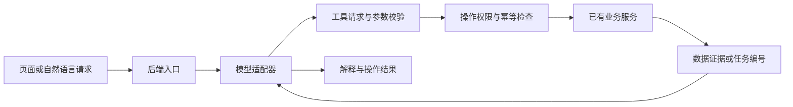

# FundPilot 可投入使用的演进计划

评估日期：2026-10-04。目标：个人可以连续使用、核对真实持仓、可靠更新数据，并通过页面或自然语言完成日常复盘。

本文基于当前代码、重新运行的测试与构建、隔离样本复现和官方模型接口文档。它是实施计划，不代表下面的功能或修复已经完成。原 `iteration_plan.md` 保留；本计划补充实证、发布门槛和在线模型操作方案，作为下一阶段建议顺序。

## 1. 产品方向与范围

把 FundPilot 做成“可信的个人投资工作台”：导入持仓和交易 → 核对账本 → 更新行情 → 查看变化与风险 → 阅读有证据的复盘 → 处理待办。每天的例行使用应在一个入口完成。

首个可用版本维持单用户、人民币、国内基金/股票/ETF、本地或个人服务器部署。延续 FastAPI + PostgreSQL + Vue，模型可选在线服务或 Ollama，不要求用户为使用项目购买本地显卡。

首版集中交付三个入口：

| 入口 | 用户完成什么 | 完成的标志 |
| --- | --- | --- |
| 今日 | 一键更新、看数据截至日期、看变化和风险、重试失败项 | 明确哪些已完成、哪些仍缺数据；能打开对应证据 |
| 我的账户 | 导入/录入、核对份额与成本、查看交易和现金 | 可与一份真实券商账单逐项核对 |
| AI 助手 | 查询持仓、解释指标、比较资产、发起更新、生成报告、准备导入草稿 | 每项结论有数据依据，每项操作有结果记录 |

保留已有研究、市场、评分和任务页面作为详情入口。扩展多用户、实时交易、券商自动下单、复杂多智能体、向量数据库和大量新闻源放到首版验收以后；若以后接入交易执行，应单独定义产品范围和验收。

## 2. 当前实际达到什么程度

已有自选、基金分析、统一持仓、股票/ETF 行情、截图识别确认导入、组合风险、评分、日报、数据健康和任务中心。已经能形成演示闭环，但账本与失败处理尚未达到连续使用的发布门槛。

本次验证：

- 现有后端测试：76 项通过；测试夹具主要使用 SQLite 内存库。有 pytest 缓存写入告警。
- 前端类型检查与生产构建：通过。初次构建遇到本地权限限制，获准重跑后成功；仍有依赖注释及约 1 MB JavaScript 分块告警。
- 使用 SQLite 内存数据库和人工数据复现下表五项缺陷，没有修改实际账户数据库。
- 未进行真实行情源联调、真实模型付费请求、PostgreSQL 升级/恢复、浏览器完整操作或连续运行验收。不能把测试通过等同于已能正式使用。

| 级别 | 实证或代码依据 | 用户影响 | 发布前要求 |
| --- | --- | --- | --- |
| P0，已复现 | `portfolio_service.portfolio_overview`：成本 1,000、没有价格，返回市值 0、盈亏 -1,000、收益率 -100% | 不完整数据被当成真实亏损，并进入报告 | 输出估值覆盖情况、缺失资产、行情日期；整体估值不完整时不展示确定的整体盈亏或完整仓位 |
| P0，已复现 | 手工期初 1,000 份，新增买入 100 份后，持仓重建只剩 100 份 | 导入的存量持仓被交易重建覆盖 | 期初持仓成为明确、有日期的账本事件；交易在期初基础上累加 |
| P0，已复现 | 补录一笔早于买入的卖出，重建报错并调用回滚后，流水数量仍从 1 变为 2 | 失败操作仍然改变账本 | 创建/删除流水、持仓与现金重建必须同一事务提交；出错全部回滚 |
| P0，已复现 | `calculate_indicators_from_nav`：截至 2 月 1 日的月收益为 10%，加入 3 月数据后变成 100% | 历史指标读到未来数据 | 在所有计算之前截断截至日期；增加未来数据不改变历史结果 |
| P0，已复现 | `result_counts` 对两成功、一失败返回 `(3, 1)`；调用方仍写 `success` | 用户误以为更新全部完成 | 标准化子项结果；返回成功 2、失败 1 和部分成功状态 |
| P0，代码审阅 | 组合回撤使用当前份额乘历史价格，按日期求和时跳过缺价，最后取 30 行 | 当前持仓模拟被当成账户实际回撤；缺价造成假跌幅 | 标明模拟口径；完整日期对齐；真实账户业绩随现金账本另行交付 |
| P1，代码审阅 | 长任务用 `BackgroundTasks`；调度按固定分钟错开，日报在预警之前 | 重启中断无法恢复，下游可能读取未完成结果 | 持久化执行、依赖推进、心跳、中断识别和幂等重试 |
| P1，代码审阅 | 数据健康解析最多 2,000 字符的日志字符串，查询未包含后台同步任务名 | 失败项可能丢失或漏报 | 子项结构化保存；前台、后台、健康页读取相同结果 |
| P1，代码审阅 | Docker 前端启动时安装依赖并跑开发服务器；`/health` 固定返回正常；在线模型变量透传不完整 | 发布、重启、故障识别和配置不可靠 | 构建产物部署、锁文件安装、数据库就绪检查、迁移步骤、完整配置验证 |

额外需要统一的口径：股票/ETF 当前取前复权历史并存入单一 `close`；估值价格和收益序列应区分。基金当前按单位净值变化计算收益，分红、拆分等事件需要单独处理。不能简单把累计净值当作所有场景的总收益序列。

## 3. 按发布门槛推进

以下工期为一名熟悉仓库的开发者的初步开发日估算，包含关键自动化验证；真实账单格式、数据质量和模型账号可用性会影响工期。阶段按验收进入下一步，长期观察时间另计。

### A：账本和数字可信，约 7–10 个开发日

交付内容：

1. 修复五项已复现缺陷及模拟回撤缺价问题，将回归样例纳入测试。
2. 设计期初持仓事件，与现有手工/截图持仓衔接；给旧数据迁移提供预览、备份与核对报告，不能从未知历史编造买卖流水。
3. 同一资产持仓唯一约束；历史补录、删除、重复提交、并发操作均不得破坏一致性。有流水的持仓不能通过独立编辑悄悄偏离账本。
4. 定义成交额、费用、成本、份额精度、已实现/未实现盈亏和价格口径。账户未来扩展以明确账户标识预留，不先建多租户体系。
5. 接口和页面统一返回/展示 `as_of`、来源、完整性、缺失原因。信息不足时返回未知，保留“已知部分市值”。

验收：1,000 + 100 必须为 1,100；失败交易前后账本一致；缺价不产生虚假全额亏损；历史计算不使用未来值；已清仓与零成本持仓有明确行为。新旧数据库迁移在测试 PostgreSQL 上各通过一次。

### B：每天可靠更新并可部署，约 7–10 个开发日

交付内容：

1. “更新今日数据”生成一个任务批次，覆盖自选和持仓内的基金/股票/ETF。
2. 依次执行：行情及市场背景 → 数据质量检查 → 指标 → 评分 → 风险预警 → 报告。依赖按结果推进，不靠等待固定分钟。
3. 以 PostgreSQL 持久化任务及子项，配一个独立 worker 进程；当前单用户负载先不引入 Redis。保留现有任务 API 的兼容入口。
4. 状态包含排队、运行、部分成功、成功、失败、跳过和中断；保存步骤、参数、心跳、重试次数、错误分类及批次 ID。用领取锁/租约避免双执行，幂等键避免重复入账或重复生成同一版本结果。
5. 周末、节假日和基金延迟披露依据适用交易日历及品种判断；暂未发布与真正失败分别显示。失败资产阻断自身下游，其他资产继续。部分数据报告必须显式说明覆盖情况。
6. 提供发布配置：前端静态构建、后端服务、worker、数据库；固定依赖安装，迁移单独执行，存活/数据库就绪检查分开。
7. 本地默认仅绑定回环地址；个人服务器访问使用登录/会话与 HTTPS，数据库不公开暴露。在线 API 密钥只在后端保存，配置与日志脱敏。
8. 备份数据库和必要配置，提供恢复到独立测试库的操作流程及核对结果。

验收：重复点击得到同一有效任务；主动终止 worker 后任务能被识别并恢复；断网后保留旧数据并显示日期；失败资产可单独重试；预警先于本批报告生成；新机器按文档启动且恢复后账本数量、份额、金额一致。

### C：真实账户的日常使用闭环，约 7–12 个开发日

交付内容：

1. 首次使用向导：检查数据库、选择数据范围、添加自选、导入期初/交易、选择可选模型、执行首次更新。无模型密钥也能完成基础操作。
2. 先支持一种实际券商 CSV 格式，提供字段映射、预览、错误行、去重和批次追溯。重复行检测须允许识别同日同额但真实不同的交易。
3. 增加现金、出入金、手续费、现金分红、红利再投、拆分及期初余额；为事件确定适用时间与顺序，再生成账户快照。
4. 账户业绩区分累计盈亏、现金流和收益率；先实现口径清楚的账户收益，再扩展时间加权/资金加权收益。只有截图期初的账户，曲线从可验证期初开始。
5. 首页显示数据状态、资产变化、关键风险和今日待办；每项异常可直达对应资产、原始交易或失败任务。预警合并重复、支持已读和过期。

验收：一份真实且可脱敏的账单，所有持仓份额在精度范围内一致、金额按约定舍入逐项对平；重复导入不重复入账；清仓再买入、分红与费用可核对；普通用户从首页完成更新和复盘，无须操作数据库或终端。

### D：在线模型成为操作助手，约 7–10 个开发日

统一模型接口、连接检测可在 B 阶段提前做；查询解释与账本写操作分别在对应基础服务验收后开放。

交付：模型设置、来源明确的报告、持仓问答、资产比较、自然语言启动更新、导入草稿与操作记录。具体设计见下一节。

### E：连续试用与发布，至少 10 个实际交易日

用真实自选与账户持续观察，记录每天更新结果、人工干预次数、账单差异、模型失败和使用耗时。休市日与未披露基金数据单独记状态，不能混算成成功更新。

发布条件：所有 P0 已关闭；没有静默账本变化；每天任务都有可解释的终态；异常均有可执行的恢复路径；完成一次独立数据库恢复；主要浏览器流程通过；AI 关闭时全部核心功能仍可用。观察期出现账本错误，应修复并重新核验相关链路。

## 4. 在线模型接入方案

### 4.1 从现有基础扩展

当前 `AIClient` 只有 `generate(prompt) -> str`；工厂支持 Ollama/DeepSeek。通义视觉客户端独立承担截图识别。项目已经保存部分报告输入、模型名称和降级原因，但尚无统一工具调用、费用记录和模型设置页面。

建议以内部统一请求/响应契约隔离供应商协议：

- 请求：消息、期望输出结构、工具清单、输出上限、超时与任务类型。
- 响应：内容、结构化数据、工具请求、token 用量、供应商请求 ID、停止原因、错误分类。
- 配置：供应商、协议类型、服务地址、模型 ID、后端密钥引用、能力列表、预算、失败策略。
- 能力：文本、图片、结构化输出、工具调用、流式返回分别检测，不假设所有“兼容接口”具有全部能力。

第一批沿用已有 DeepSeek 和通义接入经验，补通用兼容 Chat Completions 适配器；OpenAI 使用独立 Responses 适配器。其他服务按实际账号和能力扩展适配器。具体模型 ID 从用户可用模型中配置，不在规划中写死“最新/最优”型号，也不承诺未实测的质量或价格。

官方资料已确认：OpenAI、DeepSeek、通义均有工具调用机制，但模型和协议的细节有差异。工具调用包含应用接收请求、执行函数、回传结果的过程，不能仅更换 API 地址就认为项目已获得执行能力。依据：[OpenAI Function calling](https://developers.openai.com/api/docs/guides/function-calling)、[DeepSeek Tool Calls](https://api-docs.deepseek.com/guides/tool_calls/)、[通义 Function Calling](https://help.aliyun.com/zh/model-studio/qwen-function-calling)。

### 4.2 用户能实际用 AI 做什么

| 用户请求示例 | 系统执行 | 交付结果 |
| --- | --- | --- |
| “更新我的持仓，告诉我今天要注意什么” | 提交每日任务，等到可用结果后读取资产、预警与数据健康 | 任务进度、未更新资产、带证据复盘 |
| “为什么这个基金评分下降？” | 读取两个日期的评分分项、版本及对应指标 | 可核查的变化说明；没有历史记录时说明无法比较 |
| “比较这两只基金和我的持仓有什么重复” | 调用已有对比、相关性服务；穿透数据未具备时仅输出可支持的结论 | 对比表、日期范围、样本长度及数据缺口 |
| “把这份交易表整理进账户” | 解析成草稿、金额与份额校验、重复检测 | 可编辑预览；确认后通过账本服务一次入账 |
| “给我一份本周复盘” | 获取本周账户快照、交易、风险和数据覆盖 | 事实、解释、待办分开，数字可点回原始数据 |

模型负责理解请求、选择已有工具和组织解释；金额计算、收益指标、入账约束、任务状态由确定性业务代码完成。

### 4.3 操作范围与执行约束

首批只暴露少量明确工具：`get_portfolio`、`get_data_health`、`compare_funds`、`get_score_changes`、`start_daily_update`、`get_task_status`、`generate_report`、`preview_transaction_import`。名称是建议的新接口，当前并未实现完整工具层。

查询直接执行；同步与报告沿用用户已经设置的范围和预算，提交到任务系统。入账、删除及批量修改先返回具体预览，由用户确认后执行；确认与预览内容哈希、账户版本和有效期绑定，防止预览后数据变化或重复提交。现有截图导入也走相同机制。

模型不能直接访问 SQL 写接口、执行任意代码或修改评分规则。外部新闻、截图及导入内容视为业务数据，其中的文字不能扩大工具权限。服务端始终校验字段、资产代码、额度及授权，不以提示词作为唯一限制。

为单次对话设置最大工具轮数、总时长和费用上限；长操作返回任务 ID；服务超时或状态未知时先查询已有结果再决定是否重试，避免重复写入。

### 4.4 可用性、证据与费用

- 设置页提供保存、连接测试、能力测试和明确错误：密钥无效、额度不足、模型不可用、限流、网络失败分别处理。连接测试不上传真实持仓。
- 日报/解释/图片识别可分别选择模型；只启用需要的能力。在线切换以用户配置为准，不悄悄把原本仅本地的数据发送到另一服务商。
- 文本问答默认只发送必要结构化摘要；不发送账号、姓名、密钥等无关信息。截图发送前说明接收服务，并允许裁剪无关区域。
- 固定报告先生成事实块，再让模型引用事实 ID 解释；金额、日期、涨跌方向和资产名称由后端校验。校验失败重新生成一次或退回规则报告，不能靠替换敏感词保证准确。
- 保存完整且有效的结构化输入快照、快照哈希、提示词版本、模型、来源、调用用量和降级原因。替换当前任意截断 8,000 字符的快照方案。
- 以输入快照和版本缓存结果；限制并发，对可恢复失败有限重试；记录估算费用和计价版本，供应商未返回用量时标记未知。预算不足时停止新增在线请求并提供本地/规则结果。
- 首期不做复杂模型自动路由。以同一批脱敏任务比较正确率、延迟和实际账单，选择默认模型。

AI 验收样本至少覆盖：缺行情、过期行情、正常比较、评分变化、无历史记录、模型编造数字、无效 JSON、工具名错误、401/429/超时、图片字段模糊、重复操作、外部文本诱导修改账户。验收集中不允许错误数字被展示为已验证事实，不允许未确认账本写入；验证集通过不代表对任意未来输入的绝对保证。

## 5. 首个迭代的可执行任务

| 顺序 | 任务 | 主要代码落点 | 验收证据 |
| --- | --- | --- | --- |
| 1 | 把本次五项复现固化为回归样例 | `tests/test_portfolio_service.py`、`test_indicator_service.py`、`test_task_runner_service.py` | 修复前失败、修复后通过 |
| 2 | 流水与持仓原子提交、失败回滚 | `app/services/portfolio_service.py` | 补录/删除失败后流水、持仓完全一致 |
| 3 | 期初持仓事件与存量迁移 | 组合模型、Alembic、组合服务、持仓页 | 手工/截图持仓衔接交易，迁移核对报告 |
| 4 | 缺行情时的完整性契约 | 组合服务/Schema、驾驶舱、持仓页、报告输入 | 缺价时不存在虚假确定盈亏 |
| 5 | 历史日期过滤与模拟回撤口径 | 指标服务、组合服务、页面标签 | 未来数据不改变历史结果，缺价不制造跌幅 |
| 6 | 子项结果与部分成功贯通 | 任务日志/执行服务、数据健康、任务页 | 3 项中失败 1 项显示 2 成功、1 失败 |
| 7 | PostgreSQL 迁移和关键浏览器流程 | 发布脚本、CI、端到端测试 | 全新建库/旧库升级，录入/失败提示/刷新一致 |

完成这一迭代后才能把真实账户纳入受控试用。此时模型接入可以做连接及报告能力验证，但账户写操作仍以账本可靠性验收为前提。

## 6. 持续衡量“真的可用”

以下是拟定验收指标，不是目前实测能力：

| 指标 | 目标与测量方式 |
| --- | --- |
| 账本正确性 | 代表性账单逐项对平；异常、重复或并发提交不产生静默差异 |
| 数据可信度 | 每项展示的金额/指标有来源、日期和完整性状态；缺数据不会伪装成零 |
| 更新可靠性 | 连续 10 个实际交易日观察；所有批次有终态，中断能恢复，按应披露资产统计覆盖率 |
| 操作成本 | 首次配置后，例行查看和复盘的人工操作目标不超过 5 分钟；外部接口等待单独计时 |
| 响应体验 | 在记录配置的机器、50 个自选的固定样本上，常用热态只读接口及任务提交 P95 目标均小于 1 秒；先测基线再调优 |
| AI 可核查性 | 固定验收集中所有关键数值可回溯，执行动作有记录；模型失败时核心流程仍完整 |
| 恢复能力 | 备份恢复到独立库成功；明确备份频率和最大可能丢失窗口，不以“有数据库卷”代替恢复验证 |

首个完整个人可用版本粗估 28–42 个开发日，加连续交易日试用。后续扩展优先由真实使用中发现的问题决定：评分可复现与研究验证、穿透持仓、基于可信来源的新闻关联，然后再考虑语义检索与更复杂的模型编排。

## 7. 实施进度（2026-10-04）

第 5 节的首个迭代任务 1–7 已完成。实现与验证记录：

- 任务 1：五项复现（缺行情虚假亏损、期初持仓被覆盖、失败交易残留、历史指标读未来数据、子项计数错误）均已固化为回归样例，修复前失败、修复后通过；另补模拟回撤缺价用例。
- 任务 2：`create_transaction` / `delete_transaction` 与持仓重建改为同一事务，失败整体回滚；卖出按交易日重放校验，错误信息带日期与当日可用份额；删除与编辑路由对失败返回 400。
- 任务 3：新增 `opening`（期初）账本事件；手工/截图持仓在首笔交易时物化为有日期的期初记录（不改造成本）；存量回填脚本 `scripts/backfill_opening_holdings.py` 默认 dry-run、`--apply --yes` 才写入并逐项核对；已入账持仓禁止直接改份额/成本/买入日期。
- 任务 4：`/portfolio/overview` 返回 `as_of`、`price_as_of`、`valuation_status`、`is_complete`、`known_value`、`missing_price_assets`、`missing_cost_assets`、持仓 `price_date/price_source`；估值不完整时 `total_value/profit_amount/profit_rate/max_weight` 为 null，只保留已知部分市值；预警、日报、评分与诊断消费方同步适配。
- 任务 5：指标计算先截断 `calc_date`；回撤改为“当前持仓历史模拟”，按共同交易日对齐（缺价不再制造跌幅），窗口与覆盖情况随 `drawdown_basis` 返回并在页面标注。
- 任务 6：`task_run_log.result_json` 结构化保存子项结果（Alembic `0007_task_result_json` + dev 兼容补列）；状态区分成功/部分成功/失败；数据健康页读取结构化结果并覆盖 `queued_sync_watchlist_nav`；任务中心显示“部分成功”。
- 任务 7：新增 `scripts/verify_migrations.py`（临时库上自动验证全新库建库、旧库升级、降级/重升级幂等，13 项检查）；新增 `tests/test_postgres_integration.py`（`postgres` 标记，默认跳过，覆盖迁移后的账本原子性、期初衔接与结构化任务结果）；新增 `.github/workflows/ci.yml`（后端测试与 ruff、前端构建、PostgreSQL 迁移矩阵、浏览器端到端测试）；新增 Playwright 端到端测试（`npm run test:e2e`）覆盖录入交易/失败提示/刷新一致与估值完整性提示；README 补充开发校验与升级发布步骤。
- 验证：后端 100 项测试通过（含约 24 项新增回归，PostgreSQL 模块默认跳过）；`ruff` 通过；前端 `npm run typecheck`、`npm run build` 与 `npm run test:e2e`（3 项浏览器流程）通过；Alembic 0007 在 Docker PostgreSQL 上验证旧库升级、全新库创建、降级/重升级幂等；回填脚本 dry-run 零写入、apply 核对通过；API 冒烟覆盖“1000+100=1100”、超卖 400 回滚、删除 400 回滚、编辑守卫与诊断契约。

未完成与已知限制：唯一约束 `(asset_type, asset_code)` 待存量去重后再加；已实现盈亏/现金账本、真实账户回撤、股票复权口径标记仍属后续阶段；CI 尚未在 GitHub 远端实际运行过（本地已验证各步骤可执行）。

## 8. 阶段 B 实施进度（2026-10-04）

阶段 B「每天可靠更新并可部署」的核心与部署备份部分已完成（按用户确认的范围，不含登录鉴权与 HTTPS）。

- 批次内核：新增 `task_batch` / `task_batch_item`（Alembic `0008_task_batch`）。`POST /api/v1/tasks/batches/daily` 按 `daily_update:{交易日}` 幂等创建，覆盖自选与持仓的基金/股票/ETF；步骤按 行情及市场背景 → 数据质量 → 指标 → 评分 → 预警 → 报告 依赖推进，报告严格在预警之后；单资产失败只阻断自身下游（下游标记 `skipped` 并记录 `blocked_by`），全局步骤在部分数据上继续并把覆盖情况写入 `coverage_json` 与报告。
- 状态与恢复：状态含 排队/运行/成功/失败/跳过/暂未发布/中断；worker（`python -m app.worker`，compose 中为独立服务）用条件 UPDATE 领取步骤项，15 秒心跳、120 秒租约；租约过期即被识别为中断并对外显示，短暂可见后自动重排，超重试上限或超恢复窗口判失败；重复点击返回同一批次并对"暂未发布/可恢复中断"项补跑，单资产可用 `POST /tasks/batches/{id}/retry` 重试。
- 交易日历：`trade_calendar` 缓存 akshare 开市日历（离线回退周末规则）；`latest_expected_trade_date` 在收盘时间前回退上一开市日；基金 3 个开市日、股票/ETF 1 个开市日宽限内视为"暂未发布"（不算失败），抓取异常才是 `source_error` 真正失败。实测 2026-10-04（周日、国庆假期）批次正确落在 2026-09-30。
- 数据健康与报告：健康页优先读取批次同步项（成功/失败/暂未发布/中断分别显示与提示）；日报与批次一一对应（`ai_report.batch_id` 唯一约束），同一批次不会重复生成；报告文本包含数据覆盖说明；批次内产生的任务日志通过 contextvar 自动关联 `task_run_log.batch_id`。
- 部署：Dockerfile 改为 uv + `uv.lock` 冻结安装（可选镜像源构建参数），新增 `.dockerignore`；前端改为多阶段构建 + nginx 托管静态产物并反代 `/api`；compose 增加一次性 `migrate` 服务与独立 `worker` 服务，`AUTO_CREATE_TABLES=false`，所有对外端口只绑定 127.0.0.1，`.env.docker` 经 `env_file` 完整透传（含 DeepSeek/Qwen 密钥，仅后端持有）；新增 `/livez`（纯存活）与 `/readyz`（数据库可连且迁移版本等于 head，否则 503）。
- 备份恢复：`scripts/backup_database.py`（pg_dump custom 格式 + SHA256）与 `scripts/restore_database.py`（默认恢复到独立测试库、逐项核对行数与持仓份额/成本合计、默认拒绝覆盖当前库）；README 与 docs 补充操作流程。
- 验证：后端 145 项测试通过（新增批次/执行器/worker/日历/接口/健康约 40 项）与 PostgreSQL 集成测试 7 项；ruff、前端 typecheck/build、Playwright 4 条流程（含驾驶舱一键创建批次与幂等）通过；迁移矩阵 28 项检查通过；用真实 akshare 数据完整跑通一次批次（market→alerts→report，状态 success，覆盖率与报告落库正确）；备份恢复演练逐项对平（51,427 条净值、110 条评分、75 份报告、持仓合计一致）；`/livez` 与 `/readyz`（未迁移 503、已迁移 head 200、数据库停机 503 而存活保持 200）验证通过。
- 部署栈实测（Docker Compose，临时库）：`postgres → migrate（全新库一路升到 0008，退出码 0）→ backend（`AUTO_CREATE_TABLES=false`，schema 完全来自迁移）→ worker / nginx 前端`，全部 healthy；经 nginx 反代创建批次并观察 worker 消费完成；**杀掉 worker → 租约过期后批次显示"中断"（无 worker 存活也能识别）→ 重启 worker 自动重排并恢复成功（market 步骤 retry=1）**；重复点击返回同一批次。
- 已知限制：本机网络对 docker.io 拉取基础镜像严重限速（可用 `.env.docker` 的 `DOCKER_UV_INDEX_URL`/`DOCKER_NPM_REGISTRY` 或从镜像仓库预拉基础镜像；Docker 内容缓存卡住半截层时重启引擎可解）；登录鉴权与 HTTPS 未做（端口已收回环，远程访问留待下一阶段）；多 worker 并行调优、单资产超时看门狗、报告版本 supersedes 未做。
